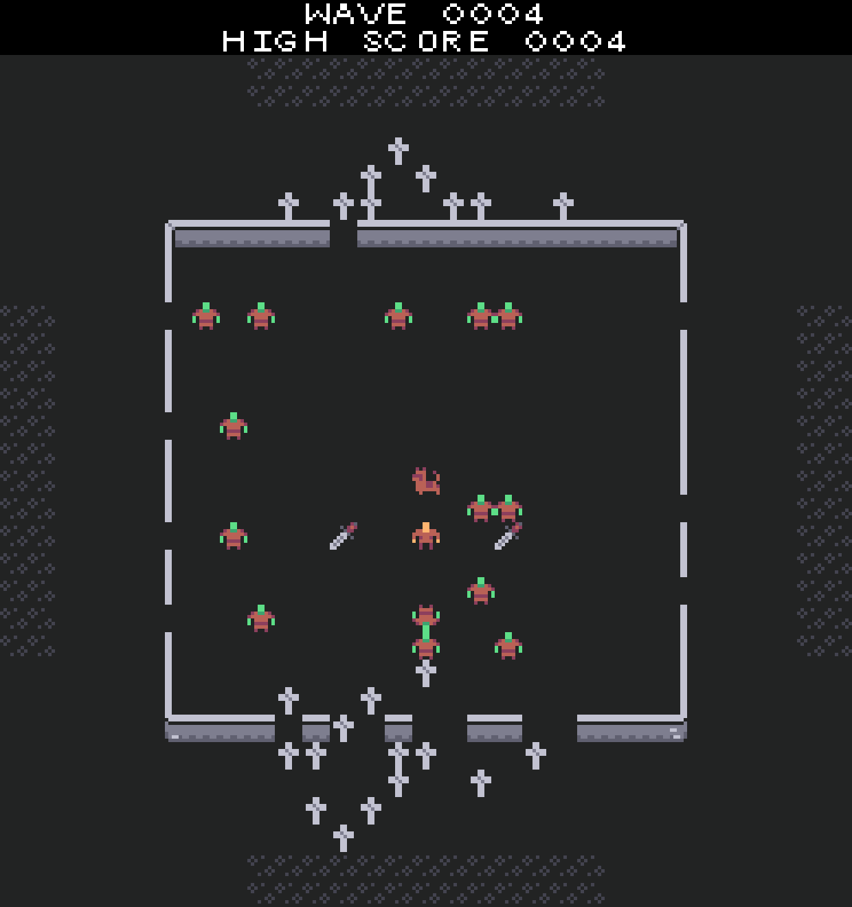

# Doggo Defender

Doggo defender is a small wave defense game made over a weekend.
It was like a game jam, but with only two participants. The idea was:
- We pick an asset pack from https://www.kenney.nl/ (together)
- We brainstorm one game idea (together)
- Then we both set out alone to make the same game with the same assets, and see how we diverged

It actually turned out quite well. I wouldn't normally be that interested in wave defense style games, but despite the simple gameplay and limited scope, I think it ended up being pretty fun.

## Credits
- Main GFX: https://www.kenney.nl/assets/micro-roguelike
- Pixel font: https://opengameart.org/content/8x8-ascii-bitmap-font-with-c-source
- Music: https://www.fesliyanstudios.com/royalty-free-music/download/retro-forest/451
- Dog bark: http://soundbible.com/2215-Labrador-Barking-Dog.html
- Dog death sound ripped from wolfenstein 3D, sorry :v

